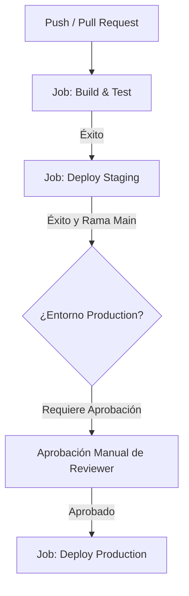

# Memoria Técnica - Laboratorio 4: Pipeline Seguro con Permissions y Environments

Este documento sirve como la memoria de prácticas y la documentación teórica correspondiente al **Laboratorio 4: Pipeline seguro con permissions y environments**. Aquí se detallan los conceptos implementados, la estructura del pipeline seguro de GitHub Actions y un análisis profundo de la seguridad de la cadena de suministro de software (Software Supply Chain Security).

---

## Índice
1. [Parte 1 — Secrets y Variables](#parte-1--secrets-y-variables)
2. [Parte 2 — Permisos (Mínimos Privilegios)](#parte-2--permisos-mínimos-privilegios)
3. [Parte 3 — Environments y Reglas de Protección](#parte-3--environments-y-reglas-de-protección)
4. [Parte 4 — Condiciones y Flujo Lógico](#parte-4--condiciones-y-flujo-lógico)
5. [Parte 5 — Análisis de Riesgos y Seguridad](#parte-5--análisis-de-riesgos-y-seguridad)
6. [Guía de Evidencia y Capturas de Pantalla](#guía-de-evidencia-y-capturas-de-pantalla)

---

## Parte 1 — Secrets y Variables

Para construir un pipeline seguro, es fundamental separar la información de configuración pública de la información altamente sensible.

### 1.1 Diferencia entre Variables (`vars`) y Secretos (`secrets`)

| Característica | Variables de Configuración (`vars`) | Secretos (`secrets`) |
| :--- | :--- | :--- |
| **Definición** | Datos no sensibles para parametrizar el pipeline. | Credenciales, contraseñas, claves API o tokens privados. |
| **Visibilidad en Logs** | **Visible**. El valor exacto se imprime en texto plano en los logs de ejecución. | **Enmascarado**. GitHub detecta el valor y lo reemplaza por `***` automáticamente. |
| **Cifrado** | Se almacenan en texto plano en la base de datos de GitHub. | Cifrados con criptografía asimétrica mediante la librería **Libsodium** antes de guardarse. |
| **Uso en el YAML** | `${{ vars.API_URL }}` | `${{ secrets.DEPLOY_SECRET }}` |

### 1.2 Scope Correcto (Alcance de Seguridad)
- **Repositorio**: Aplicables a todas las ramas y ejecuciones dentro del repositorio.
- **Entorno (Environment)**: El scope más seguro. Los secretos solo están disponibles si el Job explícitamente invoca a ese `environment`. Por ejemplo, `secrets.DEPLOY_SECRET` en el entorno de `production` puede ser diferente al del entorno de `staging`.
- **Organización**: Heredados a nivel de organización para evitar redundancias en proyectos de empresa.

En nuestro [secure-pipeline.yml](.github/workflows/secure-pipeline.yml) hemos implementado esto:
- Declaramos la URL del servidor usando `vars.API_URL`.
- Mapeamos de forma segura las credenciales de despliegue mediante `secrets.DEPLOY_SECRET` y `secrets.API_SECRET` a variables de entorno locales en el Job para evitar inyecciones maliciosas.

---

## Parte 2 — Permisos (Mínimos Privilegios)

GitHub Actions genera un token temporal (`GITHUB_TOKEN`) al inicio de cada ejecución para que el workflow pueda interactuar con la API de GitHub. Por defecto, en muchos repositorios antiguos o mal configurados, este token tiene permisos de escritura (`write`) en todo el repositorio.

### 2.1 El Bloque `permissions`
Para mitigar el secuestro de permisos (Privilege Escalation), limitamos drásticamente el alcance del token a nivel global del workflow y a nivel de Job:

```yaml
permissions:
  contents: read # El workflow solo puede leer el código, no modificarlo ni escribir en él.
```

Podemos refinar los permisos para diferentes ámbitos:
- `contents: read|write` (Acceso al código, tags, commits)
- `packages: read|write` (Acceso a GitHub Packages)
- `pull-requests: read|write` (Crear o comentar en PRs)
- `id-token: write` (Requerido para federación de identidades OIDC, ej. AWS/GCP sin secretos fijos)

### 2.2 ¿Qué ocurre si faltan permisos? (Simulación del Error)
Si un paso del pipeline intentara realizar una acción no autorizada (por ejemplo, subir un release o modificar una rama utilizando el `GITHUB_TOKEN` sin el permiso `contents: write`), GitHub abortará inmediatamente la petición.

*   **Mensaje de error típico:** `Error: Resource not accessible by integration` o `HTTP 403: Forbidden`.
*   **Consecuencia positiva:** Si un atacante inyectara código malicioso en una dependencia externa o a través de un pull request externo, el atacante no podría modificar la rama principal ni secuestrar el repositorio debido al límite estricto de permisos del token.

---

## Parte 3 — Environments y Reglas de Protección

Los entornos (**Environments**) en GitHub aíslan los despliegues de software y permiten inyectar políticas de gobierno corporativo.



### 3.1 Entornos Creados
1.  **`staging`**: Entorno de validación pre-producción. No requiere aprobaciones manuales para agilizar el feedback continuo.
2.  **`production`**: Entorno de producción crítico. Requiere obligatoriamente la regla de **Required reviewers** (aprobación manual de los ingenieros designados).

### 3.2 Protección Manual y Roles
Al asociar `environment: production` a nuestro Job en el pipeline, GitHub detiene la ejecución inmediatamente antes de que empiece este Job. Envía una notificación por correo electrónico y en la UI de GitHub a los revisores. La ejecución solo continúa si el revisor hace clic en **"Approve and deploy"**.

---

## Parte 4 — Condiciones y Flujo Lógico

El orden de ejecución y las condiciones determinan que el software solo se despliegue cuando ha sido validado.

### 4.1 Encadenamiento con `needs`
El pipeline utiliza la instrucción `needs: [build-and-test]` en staging y `needs: [deploy-staging]` en producción. Esto crea una dependencia rígida:
*   Si las pruebas unitarias fallan en `build-and-test`, **staging nunca se ejecuta**.
*   Si staging falla, **producción queda completamente bloqueado**.

### 4.2 Condicional `if` para ramas
Para evitar que ramas de desarrollo alternativas (feature branches o pull requests) desplieguen directamente a producción, configuramos una cláusula `if` en el job `deploy-production`:
```yaml
if: github.ref == 'refs/heads/main'
```
Esto asegura que el despliegue final solo es elegible si el código ya se encuentra fusionado en la rama principal (`main`).

---

## Parte 5 — Análisis de Riesgos y Seguridad

### 5.1 Riesgos de exponer secretos en logs
Si un desarrollador imprime un secreto a consola (por ejemplo, con `echo $SUPER_SECRET`), este queda almacenado en texto plano en el historial de ejecuciones de GitHub Actions. Si un atacante comprometiera una cuenta con acceso de lectura al repositorio, podría extraer estos secretos y comprometer la infraestructura de la empresa.
*   **Mitigación**: GitHub posee filtros automáticos de enmascaramiento, pero es vulnerable a codificaciones (ej. base64 u ofuscación de strings). Por tanto, la mejor práctica es **nunca** imprimir variables de autenticación.

### 5.2 Riesgos de usar `@main` en Actions externas
Cuando en un pipeline usamos una acción externa apuntando a una rama mutable como `@main` (ej: `uses: actions/checkout@main`), estamos expuestos a ataques de **compromiso de dependencias** y **envenenamiento de tags**. Si el autor de esa acción es hackeado o introduce un cambio con errores, nuestro pipeline importará automáticamente el código malicioso en su siguiente ejecución.
*   **Solución Premium**: Utilizar **hashes SHA estables de commits fijos** (como hicimos en `uses: actions/checkout@b4ffde65f46336ab88eb53be808477a3936bae11`). Esto garantiza que el código ejecutado es exactamente el que fue auditado inicialmente, cumpliendo con la especificación de seguridad **SLSA** (Software Supply Chain Levels for Software Artifacts).

---

## Guía de Evidencia y Capturas de Pantalla

Para completar el entregable del laboratorio y obtener la máxima nota, realiza y adjunta las siguientes capturas de pantalla siguiendo los pasos a continuación:

### Paso 1: Configurar los Secretos y Variables en GitHub
1. Entra a tu repositorio en GitHub y ve a **Settings** -> **Secrets and variables** -> **Actions**.
2. En la pestaña **Variables**, haz clic en *New repository variable*.
   - **Nombre:** `API_URL`
   - **Valor:** `https://api.produccion.empresa.com`
3. En la pestaña **Secrets**, haz clic en *New repository secret*.
   - **Nombre:** `DEPLOY_SECRET`
   - **Valor:** `ClaveSecretaDeDespliegue12345`
4. *(Captura la pantalla mostrando los secretos y variables creados).*
> **📸 Captura Recomendada 1**: Lista de Secrets y Variables en GitHub Settings.

---

### Paso 2: Crear los Entornos y Aprobaciones Manuales
1. En **Settings**, entra a **Environments**.
2. Haz clic en **New environment** y crea uno llamado `staging`.
3. Crea otro entorno llamado `production`.
4. En el entorno `production`, activa la casilla **Required reviewers**.
5. Añade tu propio usuario de GitHub como revisor requerido.
6. Haz clic en **Save protection rules**.
> **📸 Captura Recomendada 2**: Configuración del entorno `production` mostrando la regla de "Required reviewers" activada.

---

### Paso 3: Ejecutar el Pipeline y Aprobación Manual
1. Sube tu código a la rama principal:
   ```bash
   git add .
   git commit -m "feat: implementar pipeline seguro"
   git push origin main
   ```
2. Ve a la pestaña **Actions** en tu repositorio y haz clic en la ejecución del workflow.
3. Observarás que los jobs `build-and-test` y `deploy-staging` se ejecutan automáticamente y finalizan con éxito.
4. El job `deploy-production` se detendrá y verás un banner amarillo que indica: **"1 approval required to run jobs"**.
> **📸 Captura Recomendada 3**: Interfaz de GitHub Actions con el pipeline en pausa esperando tu aprobación.

5. Haz clic en **Review deployments**, selecciona el entorno `production`, escribe un comentario de aprobación opcional y presiona **Approve and deploy**.
6. El pipeline continuará su ejecución de forma segura y completará el despliegue en producción.
> **📸 Captura Recomendada 4**: Pipeline completamente en verde tras la aprobación manual exitosa.
